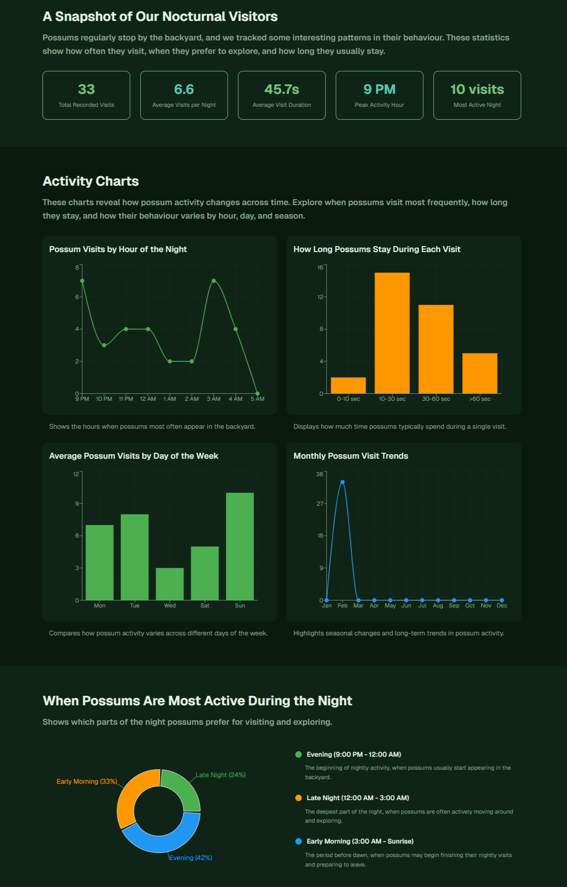
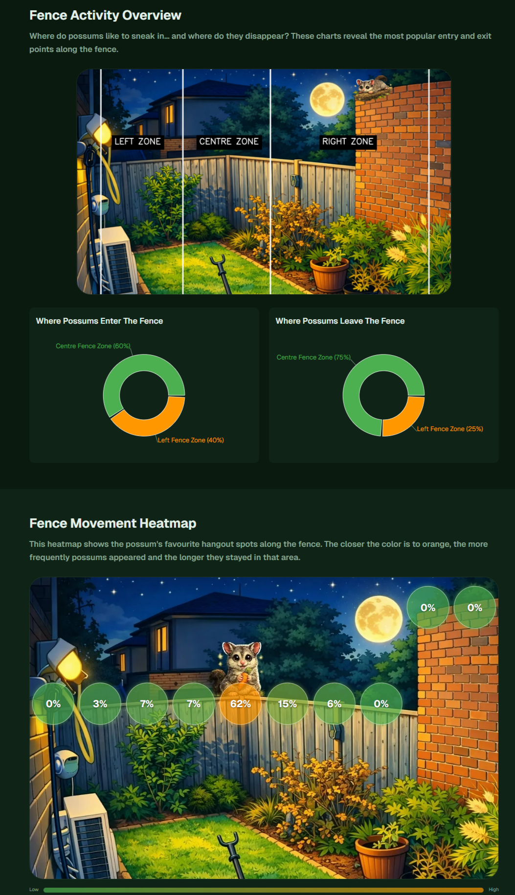
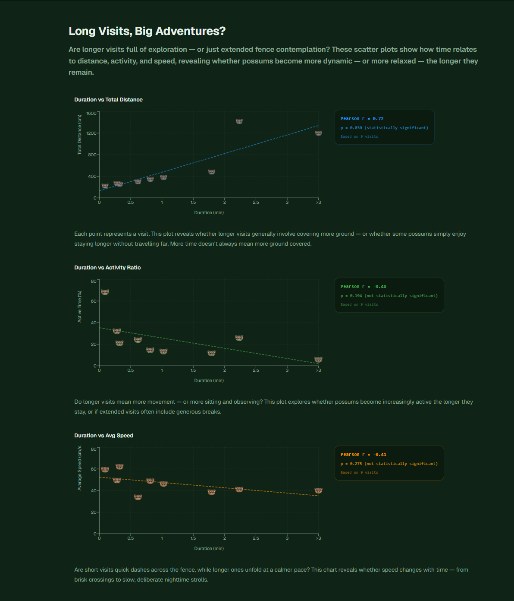
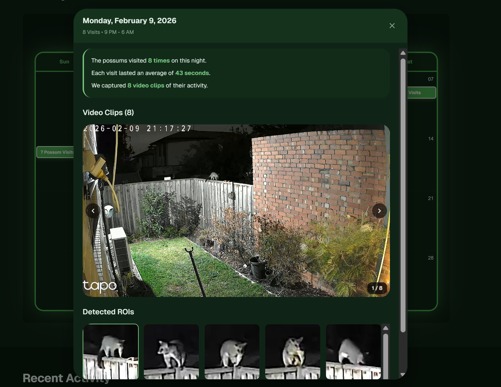
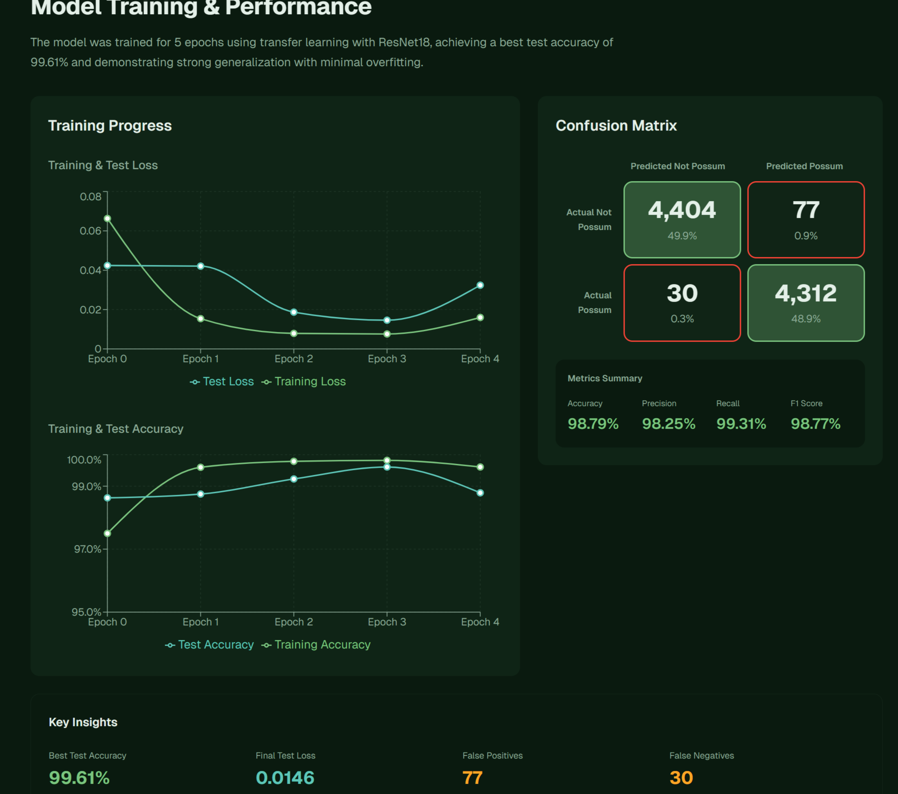

#  Real-Time Possum Detection System for Backyard Wildlife–Pet Conflict Prevention 🦦
**End-to-end computer vision pipeline for Real-Time possums detection using motion analysis and CNN classification**

🌐 **Live project website:** https://possum-tracker.sveta.com.au/en
## ⚠️ **Project in Progress / Work in Progress**  


The goal of this project is to build a production-style end-to-end computer vision system
that not only detects possums from a live night camera feed,
but also records, stores, analyzes, and visualizes wildlife activity over time.
The system combines classical computer vision (background subtraction and motion detection) with a convolutional neural network trained via transfer learning.
The system performs real-time detection, automatically opens a visit session,
stores videos, frames, ROIs, and bounding boxes in cloud storage,
persists metadata in a cloud database,
and exposes analytics through a public dashboard website. It can be extended for smart home automation (e.g., closing dog doors or activating feeding stations).


**Computer Vision · Deep Learning · CNN (Transfer Learning) · PyTorch · OpenCV · Real-Time Detection**  ·  **FastAPI** · **Google Cloud Run** · **Cloud SQL (MySQL)** · **Google Cloud Storage** 

---
## 🚀 TL;DR

Production-style end-to-end computer vision system that detects possums from live camera feeds, stores wildlife activity in cloud infrastructure, exposes analytics via FastAPI, and visualizes behaviour through an interactive public dashboard.

**Key features:**

- Real-time detection using OpenCV + Transfer Learning CNN  
- Session-based detection logic reducing false positives 
- Cloud-based media storage and structured analytics database 
- REST API powered by FastAPI 
- Public analytics dashboard with behavioural insights  
- Designed as an extensible smart home automation platform

**Data:**

Training data was collected from backyard night camera recordings using motion-based Region of Interest (ROI) extraction.
- 20,000+ labeled ROIs
- Session-based dataset splitting to prevent temporal data leakage
- Noisy low-light infrared imagery
- Real-world uncontrolled environmental conditions

**Method:**

The system combines classical computer vision and deep learning

**Results:**

The system successfully performs real-time possum detection in challenging night conditions.

- Accuracy: 98.79%
- Precision: 98.25%
- Recall: 99.31%

Compared to built-in camera motion detection, the system significantly reduces false positives and detects possums missed by standard camera algorithms.
The deployed system demonstrates stable real-time performance and robustness across different camera models.

**Behavioural Analytics Engine**

Beyond real-time detection, the system transforms raw video events into structured behavioural intelligence.
Each visit is converted into a quantified activity session, where movement, duration, spatial patterns, and temporal trends are automatically calculated and stored.
The analytics layer reveals:
- When possums are most active
- How long they stay
- How dynamically they move
- Which areas they prefer
- How behaviour changes across hours, days, and seasons

Instead of simply detecting presence, the system models behavioural patterns — turning wildlife footage into measurable ecological insights.


---


## 🏗 System Architecture (End-to-End)

The system is designed as a full pipeline, from live camera feed to analytics dashboard:

```
Live Detection Pipeline
----------------------
Live Camera (RTSP)
      ↓
Real-time CV pipeline (OpenCV + CNN)
      ↓
Visit session logic (temporal consistency: 3/5 frames)
      ↓
Frames, ROIs & Video recorded locally
      ↓
Google Cloud Storage (videos, frames, ROIs)
      ↓
Google Cloud SQL (metadata, timestamps, bounding boxes)
      ↓
FastAPI backend (Google Cloud Run)
      ↓
Public analytics website (dashboard, calendar, activity feed)
```
```

Data Preparation & Model Training (offline / static videos)
----------------------------------------------------------
Static video footage
      ↓
Motion detection → ROIs
      ↓
Manual labeling of ROIs
      ↓
Transforming / augmenting data
      ↓
Train CNN (ResNet18 transfer learning)
      ↓
Model ready for live feed inference

```

**🛠 What I Built:**
- Designed a real-time computer vision pipeline for night possum detection.

- Prepared training data from backyard video footage: extracted crops of possums and non-possum motion.

- Implemented motion-based ROI extraction with CNN classification (**ResNet18 transfer learning**).

- Developed temporal detection logic (3 out of 5 frames) to reduce false positives.

- Connected the model to live RTSP camera feeds for real-time detection.

- Implemented **visit session tracking** with automatic start/end logic.

- Stored videos, frames, ROIs, and bounding boxes in **Google Cloud Storage**.

- Persisted visit metadata, timestamps, and references in **Google Cloud SQL (MySQL)**.

- Built a **FastAPI backend** with multiple analytics endpoints.

- Designed and deployed a **public analytics website** to visualize possum activity.

- Designed foundations for smart home automation: opening feeding boxes or controlling dog doors (planned).


**🔮 Future Work / Next Steps:**

- Introduce validation dataset and early stopping

- Expand dataset diversity to improve robustness

- Experiment with alternative model architectures

- Deploy edge inference on embedded hardware (Raspberry Pi)

- Integrate smart home automation: open feeding boxes or close dog doors.


**💡 Why it Matters to Employers** 

This project showcases the end-to-end lifecycle of a real-world computer vision system: from noisy data acquisition and preprocessing, to model training, and integration with a live camera feed.  

- Demonstrates ability to implement **real-time detection pipelines**.  

- Shows hands-on experience in **data collection, preprocessing, and model training** under practical conditions.  

- Combines **classical computer vision, deep learning, and smart home automation concepts**.  

- Lays groundwork for **analytics and behavior tracking** of wildlife in urban environments.


---
## Problem & Motivation

Possums regularly visit the backyard at night, naturally triggering the curiosity and hunting instincts of our dog, Beau. To prevent potential attacks and injuries to both wildlife and pets, we decided to design a smart mechanism for the dog door that automatically closes when a possum is detected in the backyard, keeping the dog safely inside.

Initially, the primary goal was to provide food — a carrot — to the possum. However, this attracted mice. This led to the idea of a smart feeding box that only opens for possums. Due to ethical considerations (in Australia, it is illegal to feed wildlife continuously), this feature is currently conceptual and intended purely as a prototype for testing detection logic.

Possums visit the backyard at night. Detecting possums in this environment is challenging: naive motion detectors produce many false positives caused by insects, wind-driven vegetation, mice, and infrared camera noise. The main challenge is therefore to reliably identify possums in low-light conditions while minimizing false alarms.


---

## ⚠️ Key Challenges

- **Night footage with strong noise and low contrast** – limited visibility and IR artifacts make possum detection harder. 

-  **High number of false motion triggers** – insects, shadows, rain, vegetation, mice, and wind generate many non-possum ROIs. 

-  **Highly imbalanced data** – few possum appearances vs many non-possum motions make training CNNs challenging.  

-  **Strong similarity between consecutive frames** – frames from the same night are often almost identical, leading to redundant ROIs.  

-  **Continuous camera feed** – very large number of ROIs need to be processed by the CNN in real time.  

-  **Low possum movement** – possums may remain still for long periods, making motion-based detection unreliable.  

-  **ROI quality variability** – crops can be partial, occluded, or poorly illuminated, complicating CNN classification.  

- **Manual labeling constraints** – creating representative non-possum and possum datasets is time-consuming and labor-intensive.  

---
## Project Structure
```

possum_project/
│
├── main_feed.py                # Main realtime pipeline (RTSP stream processing + ML detection)
├── config.py                   # Environment variables and global configuration
├── logger.py                   # Centralized logging configuration
│
├── vision/                     # Computer vision preprocessing and dataset preparation
│   ├── crops_for_videos.py     # Motion detection and ROI extraction from frames
│   ├── random_sampling.py      # Random sampling of crops for training dataset balancing
│   └──cleanup_crops.py        # Utility to remove invalid ROI images
│   
│
├── inference/                  # Machine learning inference layer
│   ├── model_loader.py         # Model architecture definition and weight loading
│   ├── detector.py             # ROI classification logic using trained CNN
│   └── transforms.py           # Image preprocessing and normalization pipeline
│
├── visits/                     # Possum visit lifecycle management
│   └── visit_manager.py        # Visit creation, updating, and closing logic
│
├── video_utils/                # Video stream utilities
│   ├── video_capture.py        # RTSP connection handling and reconnection logic
│   └── trimming.py             # Post-visit video trimming and duration control
│
├── cloud/                      # Cloud storage integration and media processing
│   ├── uploader.py             # Upload workflow for visits, frames, and ROIs
│   ├── gcs_client.py           # Google Cloud Storage client wrapper
│   └── encoder.py              # Video transcoding and compression (H264 conversion)
│
├── db/                         # Database access layer
│   └── visit_repository.py     # SQL queries and persistence logic for visit data
│
├── models/                     # Stored trained model weights
│   └── full_model_weight.pt
│
├── model_training/             # Model development and experimentation
│   └── cnn.ipynb               # Transfer learning experiments and CNN training notebook
│
├── api/                        # Backend API serving dashboard and analytics data
│                               # Provides endpoints for visits, media retrieval,
│                               # and analytics integration
│
├── .env                        # Environment variables (not committed)
├── requirements.txt            # Project dependencies
└── README.md                   # Project documentation
```
---


## ✂️ Data Collection & Preparation

Data was collected directly from night camera recordings, not live feed.  

Motion detection was used to automatically generate **Regions of Interest (ROIs)**, which were then manually reviewed, sorted, and labeled.  

- Total collected ROIs: **20,000+ images**
- Training set: ~12,000 ROIs
- Test set: session-based split to prevent temporal leakage


#### Data Handling Decisions:

-  **Session-based splitting:** ROIs from the same night session were kept together in either train or test sets.  
    - Reason: consecutive frames are highly similar, splitting them could cause data leakage.  

-  **Padding-based resizing:** ROIs were resized to 224×224 using padding to preserve object proportions.  
    - Reason: standard resizing or cropping would distort possum features.  
 
 -  **Inclusion of motion-blurred images:**  
    - Even though some possum images were blurry due to movement, they were kept in training to reflect realistic scenarios.  
    - This helps the model learn to detect possums in natural night conditions, not just ideal still images.  

 

#### Example ROIs

**Good possum images :**  

|  .jpg) |  | | .jpg) |
|--------------------------------------|--------------------------------------|--------------------------------------|--------------------------------------|

**Blurry / Bad possum images :**  

|  .jpg) |  |.jpg) | .jpg) |
|--------------------------------------|--------------------------------------|--------------------------------------|--------------------------------------|

**Mice / non-possum images :**  

|.jpg) |   | 
|--------------------------------------|--------------------------------------|


---

## 🧠 Model

A **convolutional neural network (CNN)** was trained using **transfer learning** to distinguish possum vs non-possum ROIs.  

**Key details:**
- Pretrained backbone used; all layers frozen except the last one.
- Two strategies were evaluated:
  - Frozen backbone (only classification head trained)
  - Fine-tuning (partial unfreezing of deeper layers)
- Models were compared using validation loss.
- Fine-tuning achieved lower validation loss and more stable convergence, and was therefore selected for deployment.
- Custom classification head trained on possum vs non-possum ROIs.
- Input: motion-based ROIs extracted from video frames.
- Batch-based training to handle many small crops efficiently.
- Inference performed per ROI in real-time.
- Combines classical motion detection with CNN classification for robust possum detection.
---

## 🎯 Detection Logic

To **reduce false positives**, a temporal decision mechanism is applied:

A possum is considered **detected** only if it appears in **at least 3 out of the last 5 processed frames**.

**Why this matters:**
- Reduces single-frame misclassifications.
- Stabilizes predictions in noisy night conditions.
- Ensures robust detection when possums move slowly or remain stationary.

---

## ☁️ Cloud Infrastructure & API

The project runs on Google Cloud and follows a production-style architecture:

- **Google Cloud Storage**
  - Stores visit videos, frames, and ROI images.
  - Media is accessed via short-lived signed URLs.

- **Google Cloud SQL (MySQL)**
  - Stores visit sessions, timestamps, durations.
  - Stores bounding boxes and representative ROIs.
  - Manual approval workflow before media appears on the public website.

- **FastAPI Backend (Google Cloud Run)**
  - REST API exposing analytics and media metadata.
  - Parallel query execution and in-memory caching for performance.

### API Endpoints Overview

1. **Date range visits**
   - Returns number of visits and videos for calendar visualization.

2. **Recent activity**
   - Returns the 6 most recent possum visits with timestamps and representative images.

3. **Daily visits**
   - Returns all visits for a selected day with one video and image per visit.

4. **Dashboard statistics**
   - Returns aggregated metrics and charts used by the analytics dashboard.

---
## 🌐 Analytics Website & Visualization Platform

The project includes a public interactive website:

👉 https://possum-tracker.sveta.com.au/en

The website explains the detection system, demonstrates real possum visits, and provides behavioral analytics.
The website was developed using **Claude Code AI-assisted** development.

I used AI as a productivity tool to help generate React components and UI logic while I focused on:

- Designing data flows from backend APIs

- Defining analytics structure

- Designing UX and user navigation

- Integrating real-time detection data into visualizations

- The website acts as a presentation layer for the entire computer vision system.

### 📊 Analytics Dashboard
The dashboard visualizes key wildlife behaviour metrics collected from real detections.

It includes:

- **Core Metrics**: Total recorded possum visits, Average visits per night, Average visit duration, Peak activity hour, Most active night

- **Activity Behaviour Charts**: Possum Visits by Hour of the Night, Visit Duration Distribution, Average Visits by Day of Week, Monthly Activity Trends, Night Activity Period Analysis

- **Fence Entry and Exit Analysis**: Identifies where possums enter and leave the backyard.

- **Fence Movement Heatmap**: Visualizes the most frequently used fence zones and activity intensity.

- **Behavioural Movement Metrics** (Distribution analysis (histograms + KDE) and boxplots):  
  - Activity Ratio (%) — proportion of time spent moving vs idle during a visit  
  - Total Distance Travelled (cm)
  - Average Movement Speed (cm/s)

- **Behavioural Correlation Analysis**:  
  - Duration vs Total Distance  
  - Duration vs Activity Ratio  
  - Duration vs Average Speed  
  - Pearson correlation coefficients and statistical significance testing

Together, these visualisations transform raw detection events into quantitative behavioural intelligence, revealing movement dynamics, spatial preferences, and long-term wildlife patterns.

<p align="left">
  
  
</p>
<p align="left">
  
  
</p>

### 📅 Visit Calendar & Media Browser

The website includes an interactive calendar that allows users to explore possum activity historically.

- Displays number of visits recorded per day.

- Selecting a specific date opens:

  - All possum visits for that day.

  - Video recordings of each visit.

  - Representative ROI image for each visit.

- Visit duration statistics.

This allows users to visually review wildlife behaviour over time.
<p align="left">
  
</p>
---

## 🔦 Results

The system **successfully detects possums** in real night conditions.  
False positives caused by insects, wind-driven vegetation, or IR noise are significantly reduced compared to a naive motion detection approach.

<p align="left">
  
</p>

Model performance (test set):

- Accuracy: 0.9879  
- Precision: 0.9825  
- Recall: 0.9931

Metrics are reported on session-level split to avoid temporal data leakage.

### 🕒 Real-time Detection Snapshots

Below are real-time examples captured during live camera inference.
The system reports a possum detection only after satisfying the temporal consistency rule (≥ 3 detections within a 5-frame sliding window).


| Terminal log confirming detection                                                                                                                       | Full frame                                                                                                                                 | ROI passed to CNN                                                                                                                                    |
| -------------------------------------------------------------------------------------------------------------------------------------------------- | ---------------------------------------------------------------------------------------------------------------------------------------------------- | ---------------------------------------------------------------------------------------------------------------------------------------------------- |
|  |    |  |
|  |  |  |

**Key observations on real-time camera feed:**
- Model triggers immediately when a possum appears.

- Near real-time performance on live camera feed (processing latency up to ~10 seconds)

- Sliding window mechanism ensures stable predictions, even if possums pause or move slowly.

- Demonstrates true real-time detection, not offline inference.

- Confirms temporal alignment between logs and video frames.

- The model was trained on data collected from one camera and successfully deployed on a different camera model,
  demonstrating robustness to camera changes.

- Compared against built-in camera motion detection (TP-Link Tapo), which frequently misses possums that my system successfully detects.
---

## ⚡ Performance & Scalability

- Parallel execution of dashboard queries using ThreadPoolExecutor  
- In-memory caching layer to reduce database load  
- Connection pooling for Cloud SQL access  
- Signed URL generation for secure and temporary media delivery  
- Frame skipping and ROI filtering to maintain real-time inference speed 

---

## 🔒 Limitations 

While the system performs well in typical night conditions, several limitations exist:

- **Adverse weather and IR noise:** Performance degrades in heavy rain, strong wind, or extreme infrared camera noise.  
- **Motion-dependent detection:** Completely static possums may be missed, as detection relies on movement.  
- **Limited dataset size:** Possums appear rarely, limiting the diversity of training examples.  
- **Camera quality and setup:** Low-resolution cameras, poor angles, or distance reduce ROI quality.  
- **Incomplete non-possum coverage:** It's impossible to capture all possible non-possum motions; the model may misclassify unseen objects as possums.

---

## 🔮 Next Moves

Currently, the system stops and prints a message when a possum is detected. Planned improvements include:

- Deploy the pipeline on **Raspberry Pi** for fully autonomous edge processing.

- **Smart home integration:** Connect detection to devices such as:
  - smart feeding box prototype 🥕 (prototype to test functionality; possums will **not be fed constantly)  
  - Dog door lock mechanism 🚪  
  The system will trigger these devices when a possum is detected.

- Expand training data to further reduce rare false positives (mice, pets).

- 🎯 **Overall goal:** Gain **practical experience with CNNs**, improve **real-time detection reliability**, and build a **functional prototype for backyard wildlife management** and analytics.

---

## ⚖️ Ethical Considerations

- **Wildlife is not continuously fed**.
  Feeding box logic exists only as a prototype for detection testing.
- All recorded videos are stored privately.
- Media is displayed on the public website only after manual approval  by setting an `approved = true` flag in the database.
- This prevents accidental exposure of private or sensitive footage.
---

## 📚 What I Learned
- Full lifecycle of a computer vision project: from data collection and preprocessing → CNN training → real-time integration with live camera feed.
- Tackling noisy night-time video, detecting small moving objects, and designing robust detection pipelines.
- Combining classical computer vision (motion detection, ROI extraction) with deep learning to efficiently filter and classify objects.
- Applying **machine learning techniques to real-world problems**, turning everyday challenges (backyard wildlife management) into actionable, coded solutions.
- Strengthened skills in **problem-solving with ML**, demonstrating how to leverage models not just for theory, but to solve concrete, real-life challenges through code and intelligent systems.


---
      AI tools were used as development accelerators, not replacements for system design.
      All architecture, data modelling, backend API design, and analytics logic were designed and implemented manually.